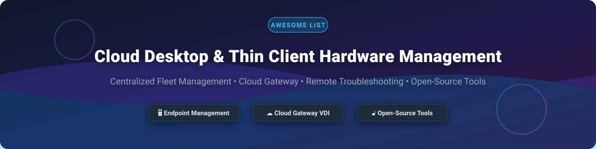

# Awesome-Cloud-Desktop-Thin-Client-Hardware-Management 🖥️ ☁️

  

  
  
  
  
  
  

---

## 🌟 Top Cloud Desktop Thin Client Hardware Management Ecosystem

**Curated List of Commercial Endpoint Management Platforms & Open-Source Thin Client Tools**  
*Focused on Centralized Device Management, Cloud Gateway Connectivity, Firmware Updates, Remote Troubleshooting & Hardware-Agnostic Endpoint OS*

**Last updated: October 2026** 📅

---

### 📌 Overview & SEO Summary

Welcome to the ultimate curated directory of **cloud desktop thin client management platforms**, **open-source endpoint management tools**, and **hardware-agnostic thin client operating systems**. Whether you are looking for enterprise-grade commercial solutions (such as *Amazon WorkSpaces Thin Client*, *Dell Wyse Management Suite*, *HP Anyware Manager*, *IGEL*, and *Stratodesk*), or self-hostable open-source alternatives (like *Zentral*, *Epoptes*, *ThinStation*, and *endpoint-aiops*), this list covers category leaders, cloud gateway architectures, and privacy-respecting device fleet management.

---

## 📑 Table of Contents

- [🏢 SaaS & Commercial Platforms](#-saas--commercial-platforms)
- [🔓 Open-Source GitHub Projects](#-open-source-github-projects)
- [🛠️ How to Contribute](#%EF%B8%8F-how-to-contribute)
- [📊 Star History](#-star-history)
- [🤝 Support & Sponsorship](#-support--sponsorship)
- [⚠️ Disclaimer](#%EF%B8%8F-disclaimer)

---

## 🏢 SaaS & Commercial Platforms 💼

> **Market Insights & Fragmentation Analysis:** 📈  
> The global thin client and cloud endpoint management market is estimated at **$5.39 Billion in 2026** (projected to reach **$12.08 Billion by 2035**), while the broader Unified Endpoint Management (UEM) market is projected to reach **$60.57 Billion**. The sector is **moderately fragmented**—combining tech giants offering hardware-bundled clients with specialized software-defined OS providers that repurpose legacy x86/ARM hardware into secure cloud thin clients.

> [!NOTE]
> SaaS and Commercial platforms are sorted below by **Company Size (Valuation / Market Cap)** in descending order.

| SaaS / Commercial Platform | Company / Owner | Company Size (Valuation / Market Cap) 📊 | Standard Edition Starting Price 💳 | Free Tier / Free Trial Limits 🎁 | Description 📝 |
| :--- | :--- | :--- | :--- | :--- | :--- |
| **[Amazon WorkSpaces Thin Client](https://aws.amazon.com/workspaces/thin-client/)** ☁️ | Amazon | **~$2.0 Trillion** | **$195 per device** (one-time hardware purchase, no monthly fee) | **No free tier** (Requires standard AWS Account setup) | **Hardware-bundled thin client** — Pre-configured hardware shipped directly to end users. **Blocks local data storage, app installation, and USB media** for zero-trust security. Centralized AWS management console. *(End of Support: March 31, 2027; no new registrations after April 20, 2026)*. |
| **[Dell Wyse Management Suite](https://www.dell.com/wyse/)** 🔷 | Dell Technologies | **~$60 Billion** | **$32 per seat/year** (Pro Edition subscription) | **1-Year Free Standard Edition** (Supports up to 10,000 basic devices) | **Hybrid cloud endpoint management** — Centralized management for Dell ThinOS, Dell Hybrid Client, and Windows IoT Enterprise endpoints. Features Active Directory integration, 2FA, HTTPS imaging, and compliance auditing. |
| **[HP Anyware Manager](https://www.hp.com/anyware/)** 🟢 | HP Inc. | **~$30 Billion** | **$240 per concurrent user/year** (HP Anyware Standard Plan) | **60-Day Free Trial** (Up to 5 trial desktop licenses) | **Connection management plane for HP Anyware** — SaaS or installable management plane to broker, provision, and monitor high-performance Anyware connections across physical workstations, cloud (AWS, Azure, GCP), and hypervisors. |
| **[ViewSonic Device Manager (VDM)](https://www.viewsonic.com/)** 🟡 | ViewSonic | **~$1.0 Billion** | **$45 per device license** | **30-Day Free Trial** (Includes up to 10 device evaluation seats) | **VTOS device management** — Streamlined management for ViewSonic thin clients with three auto-discovery methods (UDP broadcast, DHCP options, DNS CNAME). Enforces encrypted SSL communication and firmware distribution. |
| **[IGEL Cloud Gateway (ICG)](https://www.igel.com/)** 🟠 | IGEL Technology | **~$500 Million** (Private) | **$68 per endpoint/year** (IGEL Subscription License) | **90-Day Free Trial** (Full evaluation license for up to 12 devices) | **Software-defined endpoint OS and cloud gateway** — Standardizes any x86-64 hardware with IGEL OS. IGEL Universal Management Suite (UMS) with ICG provides secure HTTPS management of remote endpoints outside the corporate network without VPN. |
| **[Stratodesk NoTouch](https://www.stratodesk.com/)** 🎯 | Stratodesk | **~$250 Million** (Private) | **$50 per endpoint license** (NoTouch Center management included) | **30-Day Free Trial** (Includes full NoTouch OS image and NoTouch Center) | **Hardware-agnostic endpoint OS** — Runs on x86, x64, and ARM devices (including Raspberry Pi 4/5). **NoTouch Center** manages endpoint fleets from a single web dashboard (on-prem or cloud). Repurposes legacy PCs into VDI thin clients for Citrix, VMware Horizon, and Microsoft RDP. |
| **[10ZiG Cloud Manager](https://www.10zig.com/)** 🔵 | 10ZiG Technology | **~$100 Million** (Private) | **Free with 10ZiG hardware** / **$30 per seat/year** (Software-only edition) | **30-Day Free Trial** (Unlimited evaluation seats for 30 days) | **Thin client management with cloud connectivity** — Features Cloud Connector for secure relay between endpoints and server over the internet without VPN. Web console supports VNC/RDP shadowing, group policy updates, and firmware imaging. |
| **[Praim ThinMan](https://www.praim.com/)** 🟣 | Praim | **~$50 Million** (Private) | **$35 per device license** (ThinMan Platinum License) | **30-Day Free Trial** (Full ThinMan Advanced evaluation for 5 devices) | **Centralized thin client management** — Manages Praim thin clients and PCs with Agile4PC. Includes ThinMan Gateway for secure remote network traversal, RBAC remote control, and automated Windows Update deployment. |
| **[NComputing Management Console](https://www.ncomputing.com/)** 🖥️ | NComputing | **~$45 Million** (Private) | **$18 per device/year** (vSpace Pro Software License) | **90-Day Free Trial** (Includes 5 vSpace evaluation client seats) | **vSpace desktop virtualization management** — Central console for configuring shared computing terminals (L-series, RX-series). Supports remote screen monitoring, USB device redirection policies, and user session management. |
| **[Atrust Device Manager](https://www.atrustcorp.com/)** 🎯 | Atrust Computer | **~$30 Million** (Private) | **$25 per device license** | **30-Day Free Trial** (Full functional software for up to 5 devices) | **Fleet device management tool** — Mass-deploy configuration profiles, firmware updates, and client snapshots. Supports LAN Wake-on-LAN (WoL), scheduled reboot/shutdown, and remote desktop shadowing. |

---

## 🔓 Open-Source GitHub Projects 🌐

> [!TIP]
> Open-source solutions are sorted below by **GitHub Stars_Count** in descending order. Each Stars_Badge links directly to the project's stargazers page.

- **[Zentral](https://github.com/zentralopensource/zentral)**  🌟  
  **Event-driven endpoint management and telemetry platform**, Apache-2.0 licensed. **GitOps-driven control plane** for managing endpoints (Apple macOS, Linux) as code. Connects osquery, Santa, Munki, and Jamf Pro with real-time log ingestion (Elasticsearch, OpenSearch) and event rules engines. 🍏 🛡️

- **[Epoptes](https://github.com/epoptes/epoptes)**  🌟  
  **Open-source computer lab management and monitoring tool**, GPL-3.0 licensed. **The most widely deployed open-source thin client management solution** — translated into **40+ languages**. Offers screen broadcasting, remote command execution, client locking, and sound muting. Works seamlessly with **LTSP servers, thin/fat clients, FreeRDP, and X2Go**. 🎓 🖥️

- **[selivan/thinclient](https://github.com/selivan/thinclient)**  🌟  
  **Diskless Ubuntu network-boot thin client toolkit**, MIT licensed. Lightweight scripts to build custom Ubuntu ISOs/PXE images that boot over PXE network and run entirely in RAM, connecting users directly to remote RDP/VDI sessions. ⚡ 💾

- **[endpoint-aiops](https://github.com/endpoint-aiops/endpoint-aiops)**  🌟  
  **Governed AI-ops for managed endpoint fleets**, MIT licensed. **Vendor-neutral AI agent for endpoint management REST APIs**. Features login-storm burst analysis, automated patch/config drift detection, Fernet-encrypted credentials, dry-run safety gates, and read-only MCP modes. 🤖 🔒

- **[Thinstation](https://github.com/Thinstation/thinstation-ng)**  🌟  
  **Basic GNU/Linux thin client operating system framework**, GPL-2.0 licensed. Converts old standard PCs or dedicated thin client hardware into secure thin client terminals capable of booting via PXE network or local storage, supporting Citrix ICA, RDP, VMware Horizon, and SSH. 🐧 ⚙️

---

## 🛠️ How to Contribute 🤝

Contributions are welcome! Follow these steps to submit new thin client management platforms or open-source endpoint management software:

1. 🍴 **Fork** the repository.
2. 📝 **Add/edit** entries in `README.md` maintaining table/list structure and formatting.
3. 🔗 Include project title, official website/GitHub link, exact Stars_Count, license, and brief description.
4. 🚀 Submit a **Pull Request** with a descriptive summary of your changes.

---

## 📊 Star History

---

## 🤝 Support & Sponsorship 💖

If you find this thin client management directory useful, please consider supporting the project:

- ⭐ **Star** this repository to increase visibility!
- 🔀 **Fork** and share with fellow IT administrators, VDI engineers, and open-source advocates.
- ☕ **Sponsor & Buy Me a Coffee**: Support ongoing open-source curation via the [GitHub Sponsor Dashboard](https://github.com/sponsors/ishandutta2007).

Thank you for supporting open-source software and infrastructure documentation! ❤️

---

## ⚠️ Disclaimer ℹ️

- This is a **community-curated** list — not exhaustive and not an endorsement.
- **Amazon WorkSpaces Thin Client reaches End of Support on March 31, 2027** — existing customers can continue using the service until that date, but **no new customers accepted after April 20, 2026**. AWS recommends transitioning to partner solutions.
- **IGEL Cloud Gateway requirements vary by OS version**: IGEL OS 12 devices may not require ICG depending on architecture, but ICG 12 is required for remote OS 11 device management. Minimum server requirements: 4 GB RAM, 2 CPUs, 2 GB free space.
- Open-source solutions (Zentral, Epoptes, selivan/thinclient, endpoint-aiops, Thinstation) provide self-hosted transparency, but enterprise-grade SLA guarantees and 24/7 vendor support remain commercial offerings. **Always validate management operations against a test fleet before production deployment**. 🖥️

---

  <b>Made with ❤️ for IT administrators, VDI engineers, and open-source endpoint management advocates.</b>

